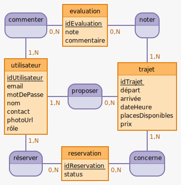

# 🚗 Lamastre-covoit - Site de Covoiturage Local

Bienvenue dans la documentation du projet de covoiturage local Lamastrois. Cette documentation couvre la planification, la structure des technologies et les modèles de données du backend et du frontend, ainsi que les user stories associées au projet.

## 🏗 Planification et Architecture du Backend

### 🛠 Technologies Backend
<<<<<<< HEAD
=======

| #  | Technologie        | Description                                                                                              |
|----|--------------------|----------------------------------------------------------------------------------------------------------|
| 1  | **Node.js**        | 🌐 Plateforme de développement côté serveur basée sur le moteur JavaScript V8 de Chrome.                 |
| 2  | **Express.js**     | 🚀 Framework web pour Node.js qui simplifie la création de serveurs HTTP.                                |
| 3  | **MySQL**          | 💾 Système de gestion de base de données relationnelle pour stocker et gérer les données de l'application. |
| 4  | **Sequelize**      | 🔄 ORM pour Node.js qui prend en charge MySQL, facilitant les interactions avec la base de données.       |
| 5  | **JWT (JSON Web Tokens)** | 🔐 Technologie pour la création de tokens de session sécurisés afin de gérer les sessions utilisateurs. |
| 6  | **Bcrypt**         | 🔒 Bibliothèque pour hasher et sécuriser les mots de passe des utilisateurs.                              |
| 7  | **Nodemailer**     | 📧 Module pour l'envoi d'emails, utilisé pour des fonctionnalités comme la confirmation d'inscription.    |
| 8  | **Jest**           | 🧪 Framework de tests pour JavaScript, utilisé pour écrire des tests unitaires et d'intégration.          |
| 9  | **Supertest**      | 🌐 Bibliothèque pour tester les API HTTP en conjonction avec Jest.
| 10 | **mysql2**      | 🌐 Module qui sert a faire des interactions avec une base de données MySQL et améliorer les performances .                                         |

## 📁 Structure du Dossier Backend avec Tests

Le backend de l'application est organisé comme suit:

- **`/backend`**: Dossier racine du projet.

  - **`/node_modules`**: Contient les modules Node.js installés.
  
  - **`/src`**: Dossier principal pour le code source de l'application.
    - **`/config`**: Contient les fichiers de configuration.
      - **`db.config.js`**: Gère la connexion à la base de données.
      
    - **`/controllers`**: Gère les actions liées aux différentes entités.
      - **`utilisateurController.js`**: Actions CRUD pour les utilisateurs.
      - **`trajetController.js`**: Actions pour les trajets.
      - **`reservationController.js`**: Actions pour les réservations.
      - **`commentaireController.js`**: Actions pour les commentaires.
      
    - **`/models`**: Définit les structures des entités de la base de données.
      - **`utilisateurModel.js`**: Structure de la table des utilisateurs.
      - **`trajetModel.js`**: Structure de la table des trajets.
      - **`reservationModel.js`**: Structure des réservations.
      - **`commentaireModel.js`**: Structure des commentaires.
      
    - **`/routes`**: Définit les routes HTTP associées aux contrôleurs.
      - **`utilisateurRoutes.js`**: Routes pour les actions sur les utilisateurs.
      - **`trajetRoutes.js`**: Routes pour les actions sur les trajets.
      - **`reservationRoutes.js`**: Routes pour les actions sur les réservations.
      - **`commentaireRoutes.js`**: Routes pour les actions sur les commentaires.
      
    - **`/middlewares`**: Contient les middlewares pour les contrôles et validations.
      - **`authMiddleware.js`**: Middleware pour l'authentification.
      
    - **`/helpers`**: Contient les fonctions utilitaires pour les tâches courantes.
      - **`utilityHelper.js`**: Fonctions utilitaires diverses.
      
  - **`/tests`**: Contient les tests pour vérifier les différentes couches.
    - **`/controllers`**: Tests pour les contrôleurs.
      - **`utilisateurController.test.js`**: Tests pour le contrôleur des utilisateurs.
      - **`trajetController.test.js`**: Tests pour le contrôleur des trajets.
      - **`reservationController.test.js`**: Tests pour le contrôleur des réservations.
      - **`commentaireController.test.js`**: Tests pour le contrôleur des commentaires.
    - **`/models`**: Tests pour les modèles.
      - **`utilisateurModel.test.js`**: Tests pour le modèle des utilisateurs.
      - **`trajetModel.test.js`**: Tests pour le modèle des trajets.
      - **`reservationModel.test.js`**: Tests pour le modèle des réservations.
      - **`commentaireModel.test.js`**: Tests pour le modèle des commentaires.
    - **`/routes`**: Tests pour les routes.
      - **`utilisateurRoutes.test.js`**: Tests pour les routes des utilisateurs.
      - **`trajetRoutes.test.js`**: Tests pour les routes des trajets.
      - **`reservationRoutes.test.js`**: Tests pour les routes des réservations.
      - **`commentaireRoutes.test.js`**: Tests pour les routes des commentaires.

  - **`/public`**: Contient les fichiers statiques.
    - **`404.html`**: Page d'erreur 404.
    - **`500.html`**: Page d'erreur 500.
    - **`/images`**: Contient les images associées.
      - **`404.png`**: Image pour la page d'erreur 404.
      - **`500.png`**: Image pour la page d'erreur 500.

  - **`server.js`**: Démarre le serveur et appelle `app.js`.
  
  - **`app.js`**: Configure les routes, middlewares, et autres aspects de l'application.

  - **`package.json`**: Gère les dépendances du projet.

  - **`.env`**: Stocke les variables d'environnement.

  - **`.gitignore`**: Fichier pour ignorer certains fichiers ou dossiers dans Git.
>>>>>>> main

| #   | Technologie               | Description                                                                                               |
| --- | ------------------------- | --------------------------------------------------------------------------------------------------------- |
| 1   | **Node.js**               | 🌐 Plateforme de développement côté serveur basée sur le moteur JavaScript V8 de Chrome.                   |
| 2   | **Express.js**            | 🚀 Framework web pour Node.js qui simplifie la création de serveurs HTTP.                                  |
| 3   | **MySQL**                 | 💾 Système de gestion de base de données relationnelle pour stocker et gérer les données de l'application. |
| 4   | **Sequelize**             | 🔄 ORM pour Node.js qui prend en charge MySQL, facilitant les interactions avec la base de données.        |
| 5   | **JWT (JSON Web Tokens)** | 🔐 Technologie pour la création de tokens de session sécurisés afin de gérer les sessions utilisateurs.    |
| 6   | **Bcrypt**                | 🔒 Bibliothèque pour hasher et sécuriser les mots de passe des utilisateurs.                               |
| 7   | **Nodemailer**            | 📧 Module pour l'envoi d'emails, utilisé pour des fonctionnalités comme la confirmation d'inscription.     |
| 8   | **Jest**                  | 🧪 Framework de tests pour JavaScript, utilisé pour écrire des tests unitaires et d'intégration.           |
| 9   | **Supertest**             | 🌐 Bibliothèque pour tester les API HTTP en conjonction avec Jest.                                         |
| 10  | **mysql2**                | 🌐 Module qui sert a faire des interactions avec une base de données MySQL et améliorer les performances . |

<<<<<<< HEAD
### 📁 Structure du Dossier Backend avec Tests

- `/backend`
  - `/node_modules` : Dossier pour les modules Node.js installés.
  - `/config`
    - `db.config.js` : Configuration de la base de données.
  - `/controllers`
    - `utilisateurController.js` : Gère les actions liées aux utilisateurs.
    - `trajetController.js` : Gère les actions liées aux trajets.
    - `reservationController.js` : Gère les actions liées aux réservations.
    - `commentaireController.js` : Gère les actions liées aux commentaires.
  - `/models`
    - `utilisateurModel.js` : Modèle pour les utilisateurs.
    - `trajetModel.js` : Modèle pour les trajets.
    - `reservationModel.js` : Modèle pour les réservations.
    - `commentaireModel.js` : Modèle pour les commentaires.
  - `/routes`
    - `utilisateurRoutes.js` : Routes pour les actions sur les utilisateurs.
    - `trajetRoutes.js` : Routes pour les actions sur les trajets.
    - `reservationRoutes.js` : Routes pour les actions sur les réservations.
    - `commentaireRoutes.js` : Routes pour les actions sur les commentaires.
  - `/middlewares`
    - `authMiddleware.js` : Middleware pour l'authentification.
  - `/helpers`
    - `utilityHelper.js` : Fonctions utilitaires diverses.
  - `/tests`
    - `/controllers`
      - `utilisateurController.test.js` : Tests pour le contrôleur des utilisateurs.
      - `trajetController.test.js` : Tests pour le contrôleur des trajets.
      - `reservationController.test.js` : Tests pour le contrôleur des réservations.
      - `commentaireController.test.js` : Tests pour le contrôleur des commentaires.
    - `/models` : Tests pour les modèles (si nécessaire).
    - `/routes`
      - `utilisateurRoutes.test.js` : Tests pour les routes des utilisateurs.
      - `trajetRoutes.test.js` : Tests pour les routes des trajets.
      - `reservationRoutes.test.js` : Tests pour les routes des réservations.
      - `commentaireRoutes.test.js` : Tests pour les routes des commentaires.
  - `app.js` : Point d'entrée principal de l'application Node.js.
  - `package.json` : Fichier de gestion des packages Node.js.
  - `.env` : Fichier pour les variables d'environnement.
  - `.gitignore` : Fichier pour ignorer les fichiers/dossiers dans git.

##

# User Stories

| Rôle                    | En tant que...          | Je veux pouvoir...                                       | Afin de...                                                           |
| ----------------------- | ----------------------- | -------------------------------------------------------- | -------------------------------------------------------------------- |
| Utilisateur             | passager ou conducteur  | m'inscrire avec mon email et un mot de passe             | créer mon compte personnel                                           |
| Utilisateur             | passager ou conducteur  | me connecter à mon compte                                | accéder aux fonctionnalités personnalisées                           |
| Utilisateur             | passager ou conducteur  | mettre à jour mon profil                                 | modifier mes informations personnelles comme mon contact et ma photo |
| Conducteur              | conducteur              | publier des trajets avec tous les détails nécessaires    | que les passagers puissent les réserver                              |
| Conducteur              | conducteur              | gérer mes trajets publiés                                | les modifier ou les supprimer si nécessaire                          |
| Passager                | passager                | rechercher des trajets disponibles                       | trouver un trajet qui convient à mes préférences                     |
| Passager                | passager                | réserver une place dans un trajet                        | et recevoir une confirmation de ma réservation                       |
| Utilisateur Authentifié | utilisateur authentifié | laisser une évaluation et un commentaire après un trajet | partager mon expérience avec la communauté                           |
| Administrateur          | administrateur          | voir tous les utilisateurs, trajets et réservations      | gérer le système de covoiturage efficacement                         |
=======
##

# User Stories

| Rôle | En tant que... | Je veux pouvoir... | Afin de... |
|------|----------------|--------------------|------------|
| Utilisateur | passager ou conducteur | m'inscrire avec mon email et un mot de passe | créer mon compte personnel |
| Utilisateur | passager ou conducteur | me connecter à mon compte | accéder aux fonctionnalités personnalisées |
| Utilisateur | passager ou conducteur | mettre à jour mon profil | modifier mes informations personnelles comme mon contact et ma photo |
| Conducteur | conducteur | publier des trajets avec tous les détails nécessaires | que les passagers puissent les réserver |
| Conducteur | conducteur | gérer mes trajets publiés | les modifier ou les supprimer si nécessaire |
| Passager | passager | rechercher des trajets disponibles | trouver un trajet qui convient à mes préférences |
| Passager | passager | réserver une place dans un trajet | et recevoir une confirmation de ma réservation |
| Utilisateur Authentifié | utilisateur authentifié | laisser une évaluation et un commentaire après un trajet | partager mon expérience avec la communauté |
| Administrateur | administrateur | voir tous les utilisateurs, trajets et réservations | gérer le système de covoiturage efficacement |

##
# Modèle Conceptuel de Données (MCD)
>>>>>>> main

##

# Modèle Conceptuel de Données (MCD)

<<<<<<< HEAD
=======
- **commenter** (<ins>_#idUtilisateur_</ins>, <ins>_#idEvaluation_</ins>)
- **concerner** (<ins>_#idTrajet_</ins>, <ins>_#idReservation_</ins>)
- **evaluation** (<ins>idEvaluation</ins>, note, commentaire)
- **noter** (<ins>_#idTrajet_</ins>, <ins>_#idEvaluation_</ins>)
- **proposer** (<ins>_#idUtilisateur_</ins>, <ins>_#idTrajet_</ins>)
- **reservation** (<ins>idReservation</ins>, status)
- **réserver** (<ins>_#idUtilisateur_</ins>, <ins>_#idReservation_</ins>)
- **trajet** (<ins>idTrajet</ins>, départ, arrivée, dateHeure, placesDisponibles, prix)
- **utilisateur** (<ins>idUtilisateur</ins>, email, motDePasse, nom, adresse, numéroDeTéléphone, photoUrl, rôle)

>>>>>>> main
## Entités

| Entité       | Attributs                                                                              | Description                                                         |
| ------------ | -------------------------------------------------------------------------------------- | ------------------------------------------------------------------- |
| Utilisateurs | `id`, `email`, `password`, `nom`, `contact`, `photo_url`, `role`                       | Détails des utilisateurs incluant les conducteurs et les passagers. |
| Trajets      | `id`, `conducteur_id`, `depart`, `arrivee`, `date_heure`, `places_disponibles`, `prix` | Informations sur les trajets offerts par les conducteurs.           |
| Réservations | `id`, `trajet_id`, `passager_id`, `status`                                             | Réservations effectuées par les passagers pour des trajets.         |
| Évaluations  | `id`, `trajet_id`, `passager_id`, `note`, `commentaire`                                | Évaluations laissées par les passagers après un trajet.             |

<<<<<<< HEAD
## Relations et Cardinalités

| Relation | Description                                                                      |
| -------- | -------------------------------------------------------------------------------- |
| Conduit  | Un **conducteur** (`Utilisateurs`) peut conduire plusieurs (`Trajets`).          |
| Réserve  | Un **passager** (`Utilisateurs`) peut réserver plusieurs (`Réservations`).       |
| Évalue   | Un **passager** (`Utilisateurs`) peut évaluer plusieurs trajets (`Évaluations`). |

| Cardinalité                 | Description                                                                                                       |
| --------------------------- | ----------------------------------------------------------------------------------------------------------------- |
| Utilisateurs à Trajets      | Un utilisateur (conducteur) peut publier plusieurs trajets. Un trajet est publié par un seul utilisateur.         |
| Utilisateurs à Réservations | Un utilisateur (passager) peut avoir plusieurs réservations. Une réservation est faite pour un seul utilisateur.  |
| Trajets à Réservations      | Un trajet peut avoir plusieurs réservations. Une réservation concerne un seul trajet.                             |
| Trajets à Évaluations       | Un trajet peut avoir plusieurs évaluations. Une évaluation concerne un seul trajet.                               |
| Utilisateurs à Évaluations  | Un utilisateur (passager) peut laisser plusieurs évaluations. Une évaluation est laissée par un seul utilisateur. |

# Modèle Logique de Données (MLD)

| Table            | Attribut             | Type                                       | Contraintes                                       |
| ---------------- | -------------------- | ------------------------------------------ | ------------------------------------------------- |
| **Utilisateurs** | `id`                 | INT                                        | PRIMARY KEY, AUTO_INCREMENT                       |
|                  | `email`              | VARCHAR(255)                               | UNIQUE, NOT NULL                                  |
|                  | `password`           | VARCHAR(255)                               | NOT NULL                                          |
|                  | `nom`                | VARCHAR(255)                               | NOT NULL                                          |
|                  | `contact`            | VARCHAR(255)                               |                                                   |
|                  | `photo_url`          | VARCHAR(255)                               |                                                   |
|                  | `role`               | ENUM('passager', 'conducteur')             | NOT NULL                                          |
| **Trajets**      | `id`                 | INT                                        | PRIMARY KEY, AUTO_INCREMENT                       |
|                  | `conducteur_id`      | INT                                        | FOREIGN KEY REFERENCES Utilisateurs(id), NOT NULL |
|                  | `depart`             | VARCHAR(255)                               | NOT NULL                                          |
|                  | `arrivee`            | VARCHAR(255)                               | NOT NULL                                          |
|                  | `date_heure`         | DATETIME                                   | NOT NULL                                          |
|                  | `places_disponibles` | INT                                        | NOT NULL                                          |
|                  | `prix`               | DECIMAL(10, 2)                             | NOT NULL                                          |
| **Réservations** | `id`                 | INT                                        | PRIMARY KEY, AUTO_INCREMENT                       |
|                  | `trajet_id`          | INT                                        | FOREIGN KEY REFERENCES Trajets(id), NOT NULL      |
|                  | `passager_id`        | INT                                        | FOREIGN KEY REFERENCES Utilisateurs(id), NOT NULL |
|                  | `status`             | ENUM('confirmée', 'en attente', 'annulée') | NOT NULL                                          |
| **Évaluations**  | `id`                 | INT                                        | PRIMARY KEY, AUTO_INCREMENT                       |
|                  | `trajet_id`          | INT                                        | FOREIGN KEY REFERENCES Trajets(id), NOT NULL      |
|                  | `passager_id`        | INT                                        | FOREIGN KEY REFERENCES Utilisateurs(id), NOT NULL |
|                  | `note`               | INT                                        | NOT NULL                                          |
|                  | `commentaire`        | TEXT                                       |                                                   |
=======
| **Entité**     | **Attributs**                                        | **Description**                                                              |
|---------------|-------------------------------------------------------|-------------------------------------------------------------------------------|
| **Utilisateur** | `idUtilisateur`, `email`, `motDePasse`, `nom`, `adresse`, `numéroDeTéléphone`, `photoUrl`, `rôle` | Détails sur les utilisateurs, y compris les conducteurs et les passagers.   |
| **Trajet**      | `idTrajet`, `départ`, `arrivée`, `dateHeure`, `placesDisponibles`, `prix` | Informations sur les trajets offerts par les conducteurs, incluant la destination, la date, et les détails du trajet. |
| **Réservation** | `idReservation`, `status`                            | Réservations effectuées par les passagers pour les trajets.                 |
| **Évaluation**  | `idEvaluation`, `note`, `commentaire`                | Évaluations laissées par les passagers après un trajet, y compris la note et le commentaire. |
>>>>>>> main

# API Endpoints

<<<<<<< HEAD
| Catégorie                    | Méthode HTTP | Endpoint              | Description                                  |
| ---------------------------- | ------------ | --------------------- | -------------------------------------------- |
| **Authentification**         | POST         | `/auth/register`      | Inscription d'un nouvel utilisateur.         |
|                              | POST         | `/auth/login`         | Connexion de l'utilisateur.                  |
| **Profil Utilisateur**       | GET          | `/users/profile`      | Obtenir le profil de l'utilisateur connecté. |
|                              | PUT          | `/users/profile`      | Mettre à jour le profil.                     |
| **Gestion des Trajets**      | POST         | `/trajets`            | Publier un nouveau trajet.                   |
|                              | GET          | `/trajets`            | Lister les trajets disponibles.              |
|                              | GET          | `/trajets/:id`        | Détails d'un trajet.                         |
|                              | PUT          | `/trajets/:id`        | Mettre à jour un trajet.                     |
|                              | DELETE       | `/trajets/:id`        | Supprimer un trajet.                         |
| **Recherche et Réservation** | GET          | `/trajets/search`     | Rechercher des trajets selon des critères.   |
|                              | POST         | `/reservations`       | Créer une nouvelle réservation.              |
|                              | PUT          | `/reservations/:id`   | Mettre à jour le statut de la réservation.   |
| **Évaluations**              | POST         | `/evaluations`        | Ajouter une évaluation pour un trajet.       |
|                              | GET          | `/evaluations`        | Lister les évaluations.                      |
| **Administration**           | GET          | `/admin/users`        | Lister tous les utilisateurs.                |
|                              | GET          | `/admin/trajets`      | Lister tous les trajets.                     |
|                              | GET          | `/admin/reservations` | Lister toutes les réservations.              |

##

# 🌐 Technologies Frontend

Bienvenue dans la section des technologies frontend utilisées pour le développement de l'interface utilisateur de notre site de covoiturage. Chaque technologie est sélectionnée pour optimiser le développement et offrir une expérience utilisateur fluide et réactive.

## 🖥️ Technologies Utilisées

| #   | Technologie         | Description                                                                                                                                              |
| --- | ------------------- | -------------------------------------------------------------------------------------------------------------------------------------------------------- |
| 1   | **React**           | 🏗️ Bibliothèque JavaScript pour la construction d'interfaces utilisateur, utilisée pour créer des vues dynamiques dans le navigateur.                     |
| 2   | **Vite.js**         | ⚡ Outil de build moderne qui offre un démarrage rapide et des rechargements à chaud pour les projets utilisant des modules ES.                           |
| 3   | **React Router**    | 🚦 Bibliothèque pour gérer le routage dans les applications React, essentielle pour une navigation fluide et conditionnelle.                              |
| 4   | **Axios**           | 🌍 Client HTTP basé sur les promesses pour le navigateur et Node.js, utilisé pour faire des requêtes HTTP efficaces.                                      |
| 5   | **Formik**          | 📝 Bibliothèque pour la gestion des formulaires en React, facilitant la validation et le suivi des états des champs.                                      |
| 6   | **Yup**             | 🔍 Constructeur de schéma pour la validation côté client, souvent utilisé avec Formik pour assurer l'intégrité des données saisies.                       |
| 7   | **SCSS**            | 🎨 Préprocesseur CSS qui permet une écriture de styles plus dynamique .                                                                                   |
| 8   | **Testing Library** | 🧪 Ensemble d'outils de test pour aider à écrire des tests robustes pour les composants React, garantissant la fiabilité des composants.                  |
| 9   | **Jest**            | 📊 Framework de tests JavaScript populaire pour les tests unitaires, assurant que le code respecte les fonctionnalités attendues.                         |
| 10  | **JSX**             | ⚛️ Syntaxe qui étend JavaScript permettant d'écrire des éléments HTML dans les scripts React, facilitant la création d'interfaces utilisateur dynamiques. |
=======

### Associations

- Utilisateur - Réserve - Trajet (1:N)
- Utilisateur - Réserve - Réservation (1:N)
- Utilisateur - Évalue - Trajet (1:N)
- Utilisateur - Évalue - Évaluation (1:N)

### Relations entre les Entités

- **Utilisateur et Trajet:** Un utilisateur peut proposer plusieurs trajets, chaque trajet étant relié à un conducteur.
- **Trajet et Réservation:** Un trajet peut être réservé par plusieurs utilisateurs, les réservations étant associées aux trajets spécifiques.
- **Trajet et Évaluation:** Un trajet peut être évalué par les passagers, permettant de recueillir des notes et des commentaires.
- **Réservation et Évaluation:** Une évaluation peut être associée à une réservation, permettant aux passagers d'évaluer leurs trajets.

### Notes Supplémentaires

- **Détails Précis:** Chaque entité contient des informations spécifiques pour refléter son rôle dans l'application.
- **Interactions:** Les entités interagissent entre elles de manière cohérente, facilitant la gestion des fonctionnalités principales de l'application de covoiturage.

## Modèle Logique de Données (MLD)

| Table         | Attribut           | Type                  | Contraintes                          |
|---------------|--------------------|-----------------------|--------------------------------------|
| **Utilisateurs** | `idUtilisateur`     | INT                   | PRIMARY KEY                          |
|               | `Email`            | VARCHAR(100)          | NOT NULL                             |
|               | `MotDePasse`       | VARCHAR(255)          | NOT NULL                             |
|               | `Nom`              | VARCHAR(100)          | NOT NULL                             |
|               | `Adresse`          | VARCHAR(255)          |                                      |
|               | `NuméroDeTéléphone`| VARCHAR(20)           |                                      |
|               | `PhotoUrl`         | VARCHAR(255)          |                                      |
|               | `Rôle`             | VARCHAR(50)           |                                      |
| **Trajets**   | `idTrajet`         | INT                   | PRIMARY KEY                          |
|               | `Départ`           | VARCHAR(100)          | NOT NULL                             |
|               | `Arrivée`          | VARCHAR(100)          | NOT NULL                             |
|               | `DateHeure`        | DATETIME              | NOT NULL                             |
|               | `PlacesDisponibles`| INT                   | NOT NULL                             |
|               | `Prix`             | FLOAT                 | NOT NULL                             |
| **Réservations** | `idReservation` | INT                   | PRIMARY KEY                          |
|               | `Status`           | VARCHAR(50)           | NOT NULL                             |
|               | `idUtilisateur`    | INT                   | FOREIGN KEY REFERENCES Utilisateurs(idUtilisateur) |
|               | `idTrajet`         | INT                   | FOREIGN KEY REFERENCES Trajets(idTrajet) |
| **Évaluations** | `idEvaluation`   | INT                   | PRIMARY KEY                          |
|               | `Note`             | FLOAT                 | NOT NULL                             |
|               | `Commentaire`      | TEXT                  |                                      |
|               | `idUtilisateur`    | INT                   | FOREIGN KEY REFERENCES Utilisateurs(idUtilisateur) |
|               | `idTrajet`         | INT                   | FOREIGN KEY REFERENCES Trajets(idTrajet) |

## Modèle Physique de Données (MPD)

### Utilisateurs

| Champ             | Type            | Description                          |
|-------------------|-----------------|--------------------------------------|
| idUtilisateur     | INT             | ID unique de l'utilisateur           |
| Email             | VARCHAR(100)    | Adresse email de l'utilisateur      |
| MotDePasse        | VARCHAR(255)    | Mot de passe de l'utilisateur       |
| Nom               | VARCHAR(100)    | Nom complet de l'utilisateur         |
| Adresse           | VARCHAR(255)    | Adresse postale de l'utilisateur    |
| NuméroDeTéléphone| VARCHAR(20)     | Numéro de téléphone de l'utilisateur|
| PhotoUrl          | VARCHAR(255)    | URL de la photo de l'utilisateur    |
| Rôle              | VARCHAR(50)     | Rôle de l'utilisateur                |

### Trajets

| Champ             | Type            | Description                          |
|-------------------|-----------------|--------------------------------------|
| idTrajet          | INT             | ID unique du trajet                  |
| Départ            | VARCHAR(100)    | Point de départ du trajet            |
| Arrivée           | VARCHAR(100)    | Point d'arrivée du trajet           |
| DateHeure         | DATETIME        | Date et heure du trajet              |
| PlacesDisponibles | INT             | Nombre de places disponibles         |
| Prix              | FLOAT           | Prix du trajet                       |

### Réservations

| Champ             | Type            | Description                          |
|-------------------|-----------------|--------------------------------------|
| idReservation     | INT             | ID unique de la réservation          |
| Status            | VARCHAR(50)     | Statut de la réservation             |
| idUtilisateur     | INT             | ID de l'utilisateur qui réserve      |
| idTrajet          | INT             | ID du trajet réservé                 |

### Évaluations

| Champ             | Type            | Description                          |
|-------------------|-----------------|--------------------------------------|
| idEvaluation      | INT             | ID unique de l'évaluation            |
| Note              | FLOAT           | Note attribuée                       |
| Commentaire       | TEXT            | Commentaire de l'utilisateur         |
| idUtilisateur     | INT             | ID de l'utilisateur qui évalue       |
| idTrajet          | INT             | ID du trajet évalué                  |

# Dictionnaire de Données

| Entité       | Attributs                                                                                                                                      |
|--------------|-----------------------------------------------------------------------------------------------------------------------------------------------|
| Évaluation    | - **idEvaluation**: Identifiant unique pour l'évaluation.  - **Note**: La note attribuée.  - **Commentaire**: Un commentaire associé à l'évaluation. |
| Utilisateur  | - **idUtilisateur**: Identifiant unique pour l'utilisateur.  - **Email**: Adresse email de l'utilisateur.  - **MotDePasse**: Mot de passe de l'utilisateur.  - **Nom**: Nom de l'utilisateur.  - **Adresse**: Adresse de l'utilisateur.  - **NuméroDeTéléphone**: Numéro de téléphone de l'utilisateur.  - **PhotoUrl**: URL de la photo de profil de l'utilisateur.  - **Rôle**: Le rôle de l'utilisateur (par exemple, admin ou utilisateur standard). |
| Trajet       | - **idTrajet**: Identifiant unique pour le trajet.  - **Départ**: Lieu de départ.  - **Arrivée**: Lieu d'arrivée.  - **DateHeure**: Date et heure du trajet.  - **PlacesDisponibles**: Nombre de places disponibles.  - **Prix**: Le prix du trajet. |
| Réservation  | - **idReservation**: Identifiant unique pour la réservation.  - **Status**: Statut de la réservation (confirmée, annulée, etc.).            |
| Entités Additionnelles | - **Commenter**, **Noter**, **Proposer**, **Réserver**, **Concerner**: Ces entités sont identifiées dans le modèle mais n'ont pas encore d'attributs associés. |

# API Endpoints

| Catégorie              | Méthode HTTP | Endpoint                 | Description                                         |
|------------------------|--------------|--------------------------|-----------------------------------------------------|
| **Authentification**   | POST         | `/auth/register`         | Inscription d'un nouvel utilisateur.                |
|                        | POST         | `/auth/login`            | Connexion de l'utilisateur.                         |
| **Profil Utilisateur** | GET          | `/users/profile`         | Obtenir le profil de l'utilisateur connecté.        |
|                        | PUT          | `/users/profile`         | Mettre à jour le profil.                            |
| **Gestion des Trajets**| POST         | `/trajets`               | Publier un nouveau trajet.                          |
|                        | GET          | `/trajets`               | Lister les trajets disponibles.                      |
|                        | GET          | `/trajets/:id`           | Détails d'un trajet.                                |
|                        | PUT          | `/trajets/:id`           | Mettre à jour un trajet.                            |
|                        | DELETE       | `/trajets/:id`           | Supprimer un trajet.                                |
| **Recherche et Réservation** | GET    | `/trajets/search`        | Rechercher des trajets selon des critères.          |
|                        | POST         | `/reservations`          | Créer une nouvelle réservation.                     |
|                        | PUT          | `/reservations/:id`      | Mettre à jour le statut de la réservation.          |
| **Évaluations**        | POST         | `/evaluations`           | Ajouter une évaluation pour un trajet.              |
|                        | GET          | `/evaluations`           | Lister les évaluations.                             |
| **Administration**     | GET          | `/admin/users`           | Lister tous les utilisateurs.                       |
|                        | GET          | `/admin/trajets`         | Lister tous les trajets.                            |
|                        | GET          | `/admin/reservations`    | Lister toutes les réservations.                     |

##

# 🌐 Technologies Frontend

Bienvenue dans la section des technologies frontend utilisées pour le développement de l'interface utilisateur du site de covoiturage local Lamastrois. 

## 🖥️ Technologies Utilisées

| #  | Technologie         | Description                                                                                              |
|----|---------------------|----------------------------------------------------------------------------------------------------------|
| 1  | **React**           | 🏗️ Bibliothèque JavaScript pour la construction d'interfaces utilisateur, utilisée pour créer des vues dynamiques dans le navigateur. |
| 2  | **Vite.js**         | ⚡ Outil de build moderne qui offre un démarrage rapide et des rechargements à chaud pour les projets utilisant des modules ES.        |
| 3  | **React Router**    | 🚦 Bibliothèque pour gérer le routage dans les applications React, essentielle pour une navigation fluide et conditionnelle.          |
| 4  | **Axios**           | 🌍 Client HTTP basé sur les promesses pour le navigateur et Node.js, utilisé pour faire des requêtes HTTP efficaces.                  |
| 5  | **Formik**          | 📝 Bibliothèque pour la gestion des formulaires en React, facilitant la validation et le suivi des états des champs.                    |
| 6  | **Yup**             | 🔍 Constructeur de schéma pour la validation côté client, souvent utilisé avec Formik pour assurer l'intégrité des données saisies.   |
| 7 | **SCSS** | 🎨 Préprocesseur CSS qui permet une écriture de styles plus dynamique . |
| 8  | **Testing Library** | 🧪 Ensemble d'outils de test pour aider à écrire des tests robustes pour les composants React, garantissant la fiabilité des composants. |
| 9  | **Jest**            | 📊 Framework de tests JavaScript populaire pour les tests unitaires, assurant que le code respecte les fonctionnalités attendues.       |
| 10 | **JSX** | ⚛️ Syntaxe qui étend JavaScript permettant d'écrire des éléments HTML dans les scripts React, facilitant la création d'interfaces utilisateur dynamiques. |
>>>>>>> main

## 📂 Structure du Dossier Frontend

- `/frontend`
  - `/public`
    - `index.html` : Fichier HTML principal, point d'entrée du frontend
  - `/src`
    - `/assets` : Contient les ressources statiques comme les images et les styles
    - `/components` : Composants React
      - `/Auth`
        - `LoginForm.jsx` : Formulaire de connexion
        - `RegisterForm.jsx` : Formulaire d'inscription
      - `/User`
        - `UserProfile.jsx` : Affiche le profil de l'utilisateur
      - `/Trips`
        - `TripList.jsx` : Affiche la liste des trajets disponibles
        - `TripForm.jsx` : Formulaire pour la création d'un trajet
        - `SearchForm.jsx` : Formulaire pour la recherche des trajets
      - `/Reservations`
        - `ReservationList.jsx` : Affiche la liste des réservations de l'utilisateur
      - `/Comments`
        - `CommentList.jsx` : Affiche tous les commentaires sur un trajet
        - `CommentForm.jsx` : Formulaire pour soumettre un nouveau commentaire
    - `/services` : Services pour la communication avec l'API
      - `authService.js` : Gère l'authentification et la session utilisateur
      - `tripService.js` : Gère les opérations liées aux trajets
      - `reservationService.js` : Gère les opérations liées aux réservations
      - `commentService.js` : Gère les opérations liées aux commentaires
    - `/hooks` : Hooks React personnalisés
    - `/utils` : Utilitaires
      - `config.js` : Configuration globale de l'application
      - `http.js` : Configuration et instances d'Axios pour les requêtes HTTP
    - `App.jsx` : Composant racine de l'application
    - `index.js` : Point d'entrée de l'application React
  - `/tests`
    - `/components` : Tests unitaires pour les composants
      - `/Auth`
        - `LoginForm.test.jsx`
        - `RegisterForm.test.jsx`
      - `/User`
        - `UserProfile.test.jsx`
      - `/Trips`
        - `TripList.test.jsx`
        - `TripForm.test.jsx`
        - `SearchForm.test.jsx`
      - `/Reservations`
        - `ReservationList.test.jsx`
      - `/Comments`
        - `CommentList.test.jsx`
        - `CommentForm.test.jsx`
    - `/services` : Tests pour les services qui communiquent avec l'API
      - `authService.test.js`
      - `tripService.test.js`
      - `reservationService.test.js`
      - `commentService.test.js`
  - `package.json` : Gère les dépendances et scripts npm
  - `vite.config.js` : Configuration spécifique à Vite.js

# 🚀 Développement et Outils Additionnels

## 1. **Git** 🌿

- 📝 Système de contrôle de version pour gérer les changements dans le code source du projet.

## 2. **GitHub** 🤝

- 🌐 Plateformes pour héberger des dépôts Git, faciliter la revue de code, l'intégration continue et le suivi des problèmes.

<<<<<<< HEAD
## 3. **Insomnia** 📦
=======
## 3. **Postman** 📦
>>>>>>> main

- 🛠️ Outils pour tester les API, permettant de simuler des requêtes client vers le serveur sans utiliser de frontend.

## 4. **ESLint** 🧹

- 🔍 Linter pour JavaScript et TypeScript, aidant à maintenir la qualité du code en vérifiant les erreurs et les problèmes de style.

## 5. **Prettier** ✨

- 💅 Formateur de code pour maintenir un style cohérent dans le code source.

## 6. **dotenv** 🔑

- 🗝️ Module pour charger les variables d'environnement à partir d'un fichier `.env`.

##

# 🗓 Planification Agile Scrum pour le site de covoituge local Lamastre-covoit

## Semaine 1 (25 - 29 Avril)

### 🚀 Jour 1 (Jeudi 25) #Lancement

- [x] 🎉 Organiser la cérémonie de lancement (25 avr. 2024)
- [x] 🔧 Configurer les outils de développement (Installation de l'IDE, Configuration des repositories Git)

### 📅 Jour 2 (Vendredi 26) #Planification

- [x] 📝 Planifier le Sprint 1 (Estimation des tâches, Affectation des ressources)
- [x] 🗒 Définir les user stories
- [x] 🏗 Créer les tâches pour le backlog (Rédaction des tickets)

### 🌞 Weekend #Repos

<<<<<<< HEAD
- [ ] 😌 Prendre du repos et se préparer pour le développement
=======
- [x] 😌 Prendre du repos et se préparer pour le développement
>>>>>>> main

## Semaine 2 (30 Avril - 5 Mai)

### 👨‍💻 Lundi à Vendredi #Développement

- [x] 🛠 Développer Sprint 1 (Mise en place de l'environnement de base, Définition de l'architecture initiale)
- [ ] 🗝 Développement des fonctionnalités d'authentification et de profil utilisateur
- [x] 🗃 Conception de la base de données

## Semaine 3 (6 - 12 Mai)

### 🔍 Lundi #Revue

- [ ] 📊 Réaliser la revue du Sprint 1
- [ ] 🔄 Organiser la rétrospective du sprint
- [ ] 🗓 Planifier le Sprint 2

### 👨‍💻 Mardi à Vendredi #Développement

- [ ] 🛠 Développer Sprint 2 (Implémenter les fonctionnalités de trajet, Construire les fonctionnalités de réservation)
- [ ] 📋 Élaborer l'affichage des listes

### 🌞 Weekend #Repos

- [ ] 😌 Continuer à se reposer pour maintenir la productivité

## Semaine 4 (13 - 19 Mai)

### 👨‍💻 Lundi à Vendredi #DéveloppementContinu

- [ ] 🛠 Poursuivre le développement du Sprint 2 (Finaliser les fonctionnalités de réservation, Développer les fonctionnalités de commentaires et retour utilisateur)

### 🌞 Weekend #Repos

- [ ] 😌 Prendre du temps pour se ressourcer

## Semaine 5 (20 - 26 Mai)

### 🔍 Lundi #RevueSprint

- [ ] 📊 Effectuer la revue du Sprint 2
- [ ] 🔄 Tenir la rétrospective du sprint
- [ ] 🗓 Planifier le Sprint 3

### 👨‍💻 Mardi à Vendredi #SprintFinal

- [ ] 🛠 Travailler sur le développement du Sprint 3 (Assurer l'intégration et les tests, Implémenter les fonctionnalités de recherche)
- [ ] 🎨 Peaufiner l'UI/UX

### 🌞 Weekend #ReposFinal

- [ ] 😌 Profiter du dernier weekend avant la finalisation

## Semaine 6 (27 - 28 Mai)

### 👨‍💻 Lundi #Finalisation

- [ ] 🏁 Finaliser le développement
- [ ] 🧪 Réaliser les tests d'acceptation
- [ ] 🚀 Préparer le déploiement

### 🔚 Mardi (28) #Déploiement

- [ ] 📊 Mener la revue finale
- [ ] 🚀 Procéder au déploiement
- [ ] 🎉 Célébrer la clôture du projet

## 📋 Kanban Board

### 📝 Backlog #Backlog

- [x] 🔧 Mise en place de l'environnement de développement complet
- [x] 📝 Définition approfondie des user stories
- [x] 🖥 Configuration initiale des serveurs backend et frontend

### 🔧 Sprint 1 #Sprint1

<<<<<<< HEAD
- [ ] 🧑‍💻 Implémenter les modèles de données utilisateur
=======
- [x] 🧑‍💻 Implémenter les modèles de données utilisateur
>>>>>>> main
- [ ] 🔗 Créer les endpoints d'authentification
- [ ] 🔐 Installer le système d'authentification sur le frontend

### 🔧 Sprint 2 #Sprint2

- [ ] 🚗 Développer les composants de trajets et réservations
- [ ] 🛠 Intégrer la gestion des réservations dans le backend
- [ ] 🎨 Créer l'interface utilisateur pour les fonctionnalités de trajets

### 🔧 Sprint 3 #Sprint3

- [ ] 🔍 Affiner les fonctionnalités de recherche
- [ ] 🧪 Mener des tests d'intégration et de sécurité
- [ ] 🎨 Améliorer l'expérience utilisateur et l'interface

### 🧪 À Tester #Tests

- [ ] 🔬 Effectuer des tests unitaires des modèles et contrôleurs
- [ ] 🖥️ Réaliser des tests d'interface pour les composants React

### 🚀 À Déployer #Déploiement

- [ ] 📦 Préparer les scripts de déploiement
- [ ] ⚙️ Configurer les serveurs de production

### ✅ Terminé #Terminé

- [ ] 🎬 Marquer le lancement du projet
- [ ] 📝 Effectuer la première revue du code

