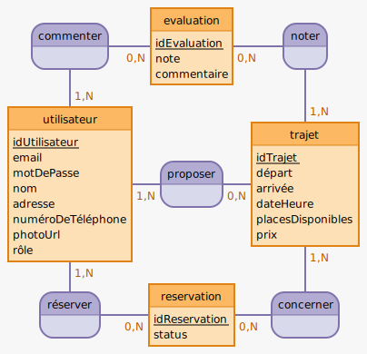

# Lamastre-covoit
## 
site de coivoiturage local

## 

# Planification et Architecture du Backend

# Technologies Backend

| #  | Technologie        | Description                                                                                              |
|----|--------------------|----------------------------------------------------------------------------------------------------------|
| 1  | **Node.js**        | Plateforme de développement côté serveur basée sur le moteur JavaScript V8 de Chrome.                    |
| 2  | **Express.js**     | Framework web pour Node.js qui simplifie la création de serveurs HTTP.                                   |
| 3  | **MySQL**          | Système de gestion de base de données relationnelle pour stocker et gérer les données de l'application.  |
| 4  | **Sequelize**      | ORM (Object-Relational Mapping) pour Node.js qui prend en charge MySQL et d'autres bases de données SQL. |
| 5  | **JWT (JSON Web Tokens)** | Technologie pour la création de tokens de session sécurisés afin de gérer les sessions utilisateurs.    |
| 6  | **Bcrypt**         | Bibliothèque pour hasher et sécuriser les mots de passe des utilisateurs.                                |
| 7  | **Nodemailer**     | Module pour Node.js permettant l'envoi d'emails, utilisé pour la confirmation d'inscription ou la réinitialisation des mots de passe. |
| 8  | **Jest**           | Framework de tests pour JavaScript, utilisé pour écrire des tests unitaires et d'intégration.             |
| 9  | **Supertest**      | Bibliothèque pour tester les API HTTP en conjonction avec Jest.                                          |

# Structure du Dossier Backend avec Tests

- `/backend`
  - `/node_modules` : Dossier pour les modules Node.js installés.
  - `/config`
    - `db.config.js` : Configuration de la base de données.
  - `/controllers`
    - `utilisateurController.js` : Gère les actions liées aux utilisateurs.
    - `trajetController.js` : Gère les actions liées aux trajets.
    - `reservationController.js` : Gère les actions liées aux réservations.
    - `commentaireController.js` : Gère les actions liées aux commentaires.
  - `/models`
    - `utilisateurModel.js` : Modèle pour les utilisateurs.
    - `trajetModel.js` : Modèle pour les trajets.
    - `reservationModel.js` : Modèle pour les réservations.
    - `commentaireModel.js` : Modèle pour les commentaires.
  - `/routes`
    - `utilisateurRoutes.js` : Routes pour les actions sur les utilisateurs.
    - `trajetRoutes.js` : Routes pour les actions sur les trajets.
    - `reservationRoutes.js` : Routes pour les actions sur les réservations.
    - `commentaireRoutes.js` : Routes pour les actions sur les commentaires.
  - `/middlewares`
    - `authMiddleware.js` : Middleware pour l'authentification.
  - `/helpers`
    - `utilityHelper.js` : Fonctions utilitaires diverses.
  - `/tests`
    - `/controllers`
      - `utilisateurController.test.js` : Tests pour le contrôleur des utilisateurs.
      - `trajetController.test.js` : Tests pour le contrôleur des trajets.
      - `reservationController.test.js` : Tests pour le contrôleur des réservations.
      - `commentaireController.test.js` : Tests pour le contrôleur des commentaires.
    - `/models` : Tests pour les modèles (si nécessaire).
    - `/routes`
      - `utilisateurRoutes.test.js` : Tests pour les routes des utilisateurs.
      - `trajetRoutes.test.js` : Tests pour les routes des trajets.
      - `reservationRoutes.test.js` : Tests pour les routes des réservations.
      - `commentaireRoutes.test.js` : Tests pour les routes des commentaires.
  - `app.js` : Point d'entrée principal de l'application Node.js.
  - `package.json` : Fichier de gestion des packages Node.js.
  - `.env` : Fichier pour les variables d'environnement.
  - `.gitignore` : Fichier pour ignorer les fichiers/dossiers dans git.

## 

## Modèles de Données

# User Stories :

| Rôle | En tant que... | Je veux pouvoir... | Afin de... |
|------|----------------|--------------------|------------|
| Utilisateur | passager ou conducteur | m'inscrire avec mon email et un mot de passe | créer mon compte personnel |
| Utilisateur | passager ou conducteur | me connecter à mon compte | accéder aux fonctionnalités personnalisées |
| Utilisateur | passager ou conducteur | mettre à jour mon profil | modifier mes informations personnelles comme mon contact et ma photo |
| Conducteur | conducteur | publier des trajets avec tous les détails nécessaires | que les passagers puissent les réserver |
| Conducteur | conducteur | gérer mes trajets publiés | les modifier ou les supprimer si nécessaire |
| Passager | passager | rechercher des trajets disponibles | trouver un trajet qui convient à mes préférences |
| Passager | passager | réserver une place dans un trajet | et recevoir une confirmation de ma réservation |
| Utilisateur Authentifié | utilisateur authentifié | laisser une évaluation et un commentaire après un trajet | partager mon expérience avec la communauté |
| Administrateur | administrateur | voir tous les utilisateurs, trajets et réservations | gérer le système de covoiturage efficacement |

## 

# Modèle Conceptuel de Données (MCD) :

## 

## Entités

| Entité       | Attributs                                             | Description                                                  |
|--------------|-------------------------------------------------------|--------------------------------------------------------------|
| Utilisateurs | `id`, `email`, `password`, `nom`, `contact`, `photo_url`, `role` | Détails des utilisateurs incluant les conducteurs et les passagers. |
| Trajets      | `id`, `conducteur_id`, `depart`, `arrivee`, `date_heure`, `places_disponibles`, `prix` | Informations sur les trajets offerts par les conducteurs.    |
| Réservations | `id`, `trajet_id`, `passager_id`, `status`           | Réservations effectuées par les passagers pour des trajets.  |
| Évaluations  | `id`, `trajet_id`, `passager_id`, `note`, `commentaire` | Évaluations laissées par les passagers après un trajet.      |

## Relations et Cardinalités

| Relation   | Description                                                 |
|------------|-------------------------------------------------------------|
| Conduit    | Un **conducteur** (`Utilisateurs`) peut conduire plusieurs (`Trajets`). |
| Réserve    | Un **passager** (`Utilisateurs`) peut réserver plusieurs (`Réservations`). |
| Évalue     | Un **passager** (`Utilisateurs`) peut évaluer plusieurs trajets (`Évaluations`). |

| Cardinalité              | Description                                                                  |
|--------------------------|------------------------------------------------------------------------------|
| Utilisateurs à Trajets   | Un utilisateur (conducteur) peut publier plusieurs trajets. Un trajet est publié par un seul utilisateur. |
| Utilisateurs à Réservations | Un utilisateur (passager) peut avoir plusieurs réservations. Une réservation est faite pour un seul utilisateur. |
| Trajets à Réservations   | Un trajet peut avoir plusieurs réservations. Une réservation concerne un seul trajet. |
| Trajets à Évaluations    | Un trajet peut avoir plusieurs évaluations. Une évaluation concerne un seul trajet. |
| Utilisateurs à Évaluations | Un utilisateur (passager) peut laisser plusieurs évaluations. Une évaluation est laissée par un seul utilisateur. |

# Modèle Logique de Données (MLD) :

| Table         | Attribut           | Type                  | Contraintes                          |
|---------------|--------------------|-----------------------|--------------------------------------|
| **Utilisateurs** | `id`               | INT                   | PRIMARY KEY, AUTO_INCREMENT          |
|               | `email`            | VARCHAR(255)          | UNIQUE, NOT NULL                     |
|               | `password`         | VARCHAR(255)          | NOT NULL                             |
|               | `nom`              | VARCHAR(255)          | NOT NULL                             |
|               | `contact`          | VARCHAR(255)          |                                      |
|               | `photo_url`        | VARCHAR(255)          |                                      |
|               | `role`             | ENUM('passager', 'conducteur') | NOT NULL                |
| **Trajets**   | `id`               | INT                   | PRIMARY KEY, AUTO_INCREMENT          |
|               | `conducteur_id`    | INT                   | FOREIGN KEY REFERENCES Utilisateurs(id), NOT NULL |
|               | `depart`           | VARCHAR(255)          | NOT NULL                             |
|               | `arrivee`          | VARCHAR(255)          | NOT NULL                             |
|               | `date_heure`       | DATETIME              | NOT NULL                             |
|               | `places_disponibles` | INT                 | NOT NULL                             |
|               | `prix`             | DECIMAL(10, 2)        | NOT NULL                             |
| **Réservations** | `id`             | INT                   | PRIMARY KEY, AUTO_INCREMENT          |
|               | `trajet_id`        | INT                   | FOREIGN KEY REFERENCES Trajets(id), NOT NULL |
|               | `passager_id`      | INT                   | FOREIGN KEY REFERENCES Utilisateurs(id), NOT NULL |
|               | `status`           | ENUM('confirmée', 'en attente', 'annulée') | NOT NULL     |
| **Évaluations** | `id`             | INT                   | PRIMARY KEY, AUTO_INCREMENT          |
|               | `trajet_id`        | INT                   | FOREIGN KEY REFERENCES Trajets(id), NOT NULL |
|               | `passager_id`      | INT                   | FOREIGN KEY REFERENCES Utilisateurs(id), NOT NULL |
|               | `note`             | INT                   | NOT NULL                             |
|               | `commentaire`      | TEXT                  |                                      |

# API Endpoints :

| Catégorie              | Méthode HTTP | Endpoint                 | Description                                         |
|------------------------|--------------|--------------------------|-----------------------------------------------------|
| **Authentification**   | POST         | `/auth/register`         | Inscription d'un nouvel utilisateur.                |
|                        | POST         | `/auth/login`            | Connexion de l'utilisateur.                         |
| **Profil Utilisateur** | GET          | `/users/profile`         | Obtenir le profil de l'utilisateur connecté.        |
|                        | PUT          | `/users/profile`         | Mettre à jour le profil.                            |
| **Gestion des Trajets**| POST         | `/trajets`               | Publier un nouveau trajet.                          |
|                        | GET          | `/trajets`               | Lister les trajets disponibles.                      |
|                        | GET          | `/trajets/:id`           | Détails d'un trajet.                                |
|                        | PUT          | `/trajets/:id`           | Mettre à jour un trajet.                            |
|                        | DELETE       | `/trajets/:id`           | Supprimer un trajet.                                |
| **Recherche et Réservation** | GET    | `/trajets/search`        | Rechercher des trajets selon des critères.          |
|                        | POST         | `/reservations`          | Créer une nouvelle réservation.                     |
|                        | PUT          | `/reservations/:id`      | Mettre à jour le statut de la réservation.          |
| **Évaluations**        | POST         | `/evaluations`           | Ajouter une évaluation pour un trajet.              |
|                        | GET          | `/evaluations`           | Lister les évaluations.                             |
| **Administration**     | GET          | `/admin/users`           | Lister tous les utilisateurs.                       |
|                        | GET          | `/admin/trajets`         | Lister tous les trajets.                            |
|                        | GET          | `/admin/reservations`    | Lister toutes les réservations.                     |

## 

# Technologies Frontend

| #  | Technologie         | Description                                                                                              |
|----|---------------------|----------------------------------------------------------------------------------------------------------|
| 1  | **React**           | Bibliothèque JavaScript pour la construction d'interfaces utilisateur, utilisée pour créer des vues dynamiques dans le navigateur. |
| 2  | **Vite.js**         | Outil de build moderne qui offre un démarrage rapide et des rechargements à chaud pour les projets utilisant des modules ES.        |
| 3  | **React Router**    | Bibliothèque pour gérer le routage dans les applications React.                                           |
| 4  | **Axios**           | Client HTTP basé sur les promesses pour le navigateur et Node.js, utilisé pour faire des requêtes HTTP.  |
| 5  | **Formik**          | Bibliothèque pour la gestion des formulaires en React, facilitant la validation et le suivi des états des champs.                    |
| 6  | **Yup**             | Constructeur de schéma pour la validation côté client, souvent utilisé avec Formik.                      |
| 7  | **Bootstrap**       | Framework CSS pour développer rapidement des interfaces utilisateur réactives et attrayantes.            |
| 8  | **Testing Library** | Outils de test pour aider à écrire des tests robustes pour les composants React.                         |
| 9  | **Jest**            | Framework de tests JavaScript populaire pour les tests unitaires.                                        |

# Structure du Dossier Frontend

- `/frontend`
  - `/public`
    - `index.html` : Fichier HTML principal, point d'entrée du frontend
  - `/src`
    - `/assets` : Contient les ressources statiques comme les images et les styles
    - `/components` : Composants React
      - `/Auth`
        - `LoginForm.jsx` : Formulaire de connexion
        - `RegisterForm.jsx` : Formulaire d'inscription
      - `/User`
        - `UserProfile.jsx` : Affiche le profil de l'utilisateur
      - `/Trips`
        - `TripList.jsx` : Affiche la liste des trajets disponibles
        - `TripForm.jsx` : Formulaire pour la création d'un trajet
        - `SearchForm.jsx` : Formulaire pour la recherche des trajets
      - `/Reservations`
        - `ReservationList.jsx` : Affiche la liste des réservations de l'utilisateur
      - `/Comments`
        - `CommentList.jsx` : Affiche tous les commentaires sur un trajet
        - `CommentForm.jsx` : Formulaire pour soumettre un nouveau commentaire
    - `/services` : Services pour la communication avec l'API
      - `authService.js` : Gère l'authentification et la session utilisateur
      - `tripService.js` : Gère les opérations liées aux trajets
      - `reservationService.js` : Gère les opérations liées aux réservations
      - `commentService.js` : Gère les opérations liées aux commentaires
    - `/hooks` : Hooks React personnalisés
    - `/utils` : Utilitaires
      - `config.js` : Configuration globale de l'application
      - `http.js` : Configuration et instances d'Axios pour les requêtes HTTP
    - `App.jsx` : Composant racine de l'application
    - `index.js` : Point d'entrée de l'application React
  - `/tests`
    - `/components` : Tests unitaires pour les composants
      - `/Auth`
        - `LoginForm.test.jsx`
        - `RegisterForm.test.jsx`
      - `/User`
        - `UserProfile.test.jsx`
      - `/Trips`
        - `TripList.test.jsx`
        - `TripForm.test.jsx`
        - `SearchForm.test.jsx`
      - `/Reservations`
        - `ReservationList.test.jsx`
      - `/Comments`
        - `CommentList.test.jsx`
        - `CommentForm.test.jsx`
    - `/services` : Tests pour les services qui communiquent avec l'API
      - `authService.test.js`
      - `tripService.test.js`
      - `reservationService.test.js`
      - `commentService.test.js`
  - `package.json` : Gère les dépendances et scripts npm
  - `vite.config.js` : Configuration spécifique à Vite.js

## 

# Planification Agile Scrum

## **Semaine 1 (25 - 29 Avril)**

### **Jour 1 (Jeudi 25)**
- [ ] Cérémonie de lancement
- [ ] Présentation du projet
- [ ] Configuration des outils de développement

### **Jour 2 (Vendredi 26)**
- [ ] Planification du Sprint 1
- [ ] Définition des user stories
- [ ] Création des tâches pour le backlog

### **Weekend**
- [ ] Repos

## **Semaine 2 (30 Avril - 5 Mai)**

### **Lundi à Vendredi**
- [ ] Développement Sprint 1
  - Mise en place de l'environnement de base
  - Architecture initiale
  - Début de développement des fonctionnalités d'authentification et de profil utilisateur

## **Semaine 3 (6 - 12 Mai)**

### **Lundi**
- [ ] Revue du Sprint 1
- [ ] Rétrospective
- [ ] Planification du Sprint 2

### **Mardi à Vendredi**
- [ ] Développement Sprint 2
  - Fonctionnalités de trajet
  - Fonctionnalités de réservation
  - Affichage des listes

### **Weekend**
- [ ] Repos

## **Semaine 4 (13 - 19 Mai)**

### **Lundi à Vendredi**
- [ ] Continuation du Sprint 2
  - Finalisation des fonctionnalités de réservation
  - Développement des fonctionnalités de commentaires

### **Weekend**
- [ ] Repos

## **Semaine 5 (20 - 26 Mai)**

### **Lundi**
- [ ] Revue du Sprint 2
- [ ] Rétrospective
- [ ] Planification du Sprint 3

### **Mardi à Vendredi**
- [ ] Développement Sprint 3
  - Intégration et tests
  - Implémentation des fonctionnalités de recherche
  - Peaufinage de l'UI/UX

### **Weekend**
- [ ] Repos

## **Semaine 6 (27 - 28 Mai)**

### **Lundi**
- [ ] Finalisation du développement
- [ ] Tests d'acceptation
- [ ] Préparation au déploiement

### **Mardi (28)**
- [ ] Revue finale
- [ ] Déploiement
- [ ] Clôture du projet

## **Kanban Board**

### **Backlog**
- [ ] Mise en place de l'environnement de développement
- [ ] Définition des user stories
- [ ] Configuration initiale des serveurs backend et frontend

### **Sprint 1**
- [ ] Implémentation des modèles de données utilisateur
- [ ] Création des endpoints d'authentification
- [ ] Mise en place du système d'authentification sur le frontend

### **Sprint 2**
- [ ] Développement des composants de trajets et réservations
- [ ] Intégration de la gestion des réservations dans le backend
- [ ] Création de l'interface utilisateur pour les fonctionnalités de trajets

### **Sprint 3**
- [ ] Finalisation des fonctionnalités de recherche
- [ ] Tests d'intégration et de sécurité
- [ ] Peaufinage de l'expérience utilisateur et de l'interface

### **À Tester**
- [ ] Tests unitaires des modèles et contrôleurs
- [ ] Tests d'interface des composants React

### **À Déployer**
- [ ] Préparation des scripts de déploiement
- [ ] Configuration des serveurs de production

### **Terminé**
- [ ] Lancement du projet
- [ ] Première revue du code

